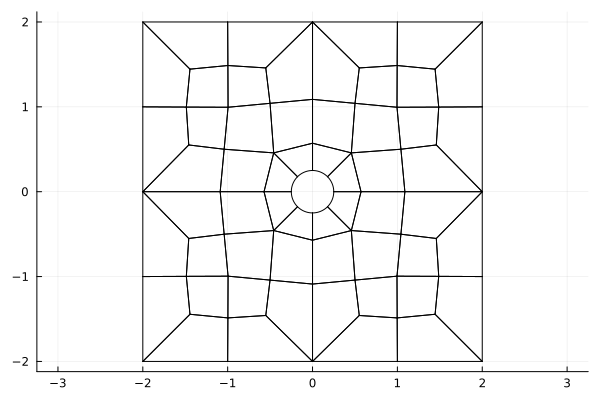

# `MeshData` type

[`MeshData`](@ref) includes fields such as
* `xyz::NTuple{Dim, ...}`: nodal interpolation points mapped to physical elements. All elements of `xyz` are ``N_p \times N_{\rm elements}`` matrices, where ``N_p`` are the number of nodal points on each element.
* `xyzq::NTuple{Dim, ...}, wJq`: volume quadrature points/weights mapped to physical elements. All elements these tuples are ``N_q \times N_{\rm elements}`` matrices, where ``N_q`` is the number of quadrature points on each element.
* `xyzf::NTuple{Dim, ...}`: face quadrature points mapped to physical elements. All elements of `xyz` are ``N_f \times N_{\rm elements}`` matrices, where ``N_f`` is the number of face points on each element.
* `mapP, mapB`: indexing arrays for inter-element node connectivity (`mapP`) and for extracting boundary nodes from the list of face nodes `xyzf` (`mapB`). `mapP` is a matrix of size ``N_f \times N_{\rm elements}``, while the length of `mapB` is the total number of nodes on the boundary.
* `rstxyzJ::SMatrix{Dim, Dim}`: volume geometric terms ``G_{ij} = \frac{\partial x_i}{\partial \hat{x}_j}``. Each element of `rstxyzJ` is a matrix of size ``N_p \times N_{\rm elements}``.
* `J, Jf`: volume and surface Jacobians evaluated at interpolation points and surface quadrature points, respectively. `J` is a matrix of size ``N_p \times N_{\rm elements}``, while `Jf` is a matrix of size ``N_f \times N_{\rm elements}``. 
* `nxyz::NTuple{Dim, ...}` and `nxyzJ::NTuple{Dim, ...}`: normalized and `Jf` scaled outward normals evaluated at surface quadrature points. Each element of `nxyzJ` is a matrix of size ``N_f \times N_{\rm elements}``. 

These are the main quantities used to construct a DG solver. Information specific to the type of mesh used is stored in the `md.mesh_type` field. 

# Setting up `md::MeshData`

The [`MeshData`](@ref) struct contains data for high order DG methods useful for evaluating DG formulations in a matrix-free fashion.

## Generating unstructured meshes

For convenience, simple uniform meshes are included in with `StartUpDG.jl` via [`uniform_mesh`](@ref)
```julia
using StartUpDG
num_cells_x, num_cells_y, num_cells_z = 4, 2, 8
(VX,), EToV = uniform_mesh(Line(), num_cells_x)
(VX, VY), EToV = uniform_mesh(Tri(), num_cells_x, num_cells_y)
(VX, VY), EToV = uniform_mesh(Quad(), num_cells_x, num_cells_y)
(VX, VY, VZ), EToV = uniform_mesh(Tet(), num_cells_x, num_cells_y, num_cells_z)
(VX, VY, VZ), EToV = uniform_mesh(Pyr(), num_cells_x, num_cells_y, num_cells_z)
(VX, VY, VZ), EToV = uniform_mesh(Wedge(), num_cells_x, num_cells_y, num_cells_z)
(VX, VY, VZ), EToV = uniform_mesh(Hex(), num_cells_x, num_cells_y, num_cells_z)
```
The uniform triangular mesh is constructed by creating a uniform quadrilateral mesh then bisecting each quad into two triangles. Wedge meshes are constructed similarly. Tet meshes are constructed by dividing each hexahedron into 5 tetrahedral elements. Pyramid meshes are constructed by dividing each hexahedron into 6 pyramids. 

## Initializing high order DG mesh data

Given unstructured mesh information (tuple of vertex coordinates `VXYZ` and index array `EToV`) high order DG mesh data can be constructed as follows:
```julia
md = MeshData(VXYZ, EToV, rd)
```
One can also construct `MeshData` for a Cartesian domain by specifying `cells_per_dimension` and the bounding coordinates of the Cartesian domain. For example, the following creates a 2-by-4 element mesh on [-1,1] x [-2,2]. 
```julia
rd = RefElemData(Tri(), 3)
cells_per_dimension_x, cells_per_dimension_y = 2, 4
md = MeshData(cells_per_dimension_x, cells_per_dimension_y, rd; 
              coordinates_min=(-1, -2), coordinates_max=(1, 2))
```

## Enforcing periodic boundary conditions

Periodic boundary conditions can be enforced via the `is_periodic` keyword argument 
```julia
md_periodic = MeshData((VX, VY), EToV, rd; is_periodic=true) # periodic in both x and y coordinates
md_periodic_x = MeshData((VX, VY), EToV, rd; is_periodic=(true, false)) # periodic in x direction, but not y
```
or by calling [`make_periodic`](@ref), which returns a new `MeshData` instance
```julia
md = MeshData((VX, VY), EToV, rd)
md_periodic = make_periodic(md) # periodic in both x and y coordinates
md_periodic_x = make_periodic(md, true, false) # periodic in x direction, but not y
```
In either case, the `MeshData` indexing arrays fields `mapP`,`mapB`, and `FToF` are modified to account for periodicity.

One can check which dimensions are periodic via the `is_periodic` field of `MeshData`. For example, the `md_periodic_x` example above gives
```julia
julia> md_periodic_x.is_periodic
(true, false)
```

## Creating curved meshes

It is common to generate curved meshes by first generating a linear mesh, then moving high order nodes on the linear mesh. This can be done by calling [`MeshData`](@ref) again with new `x, y` coordinates:
```julia
md = MeshData((VX, VY), EToV, rd)
(; x, y ) = md
# <-- code to modify high order nodes (x,y)
md_curved = MeshData(rd, md, x, y)
```
`MeshData(rd, md, x, y)` and `MeshData(rd, md, x, y, z)` are implemented for 2D and 3D, though this is not currently implemented in 1D.

More generally, one can create a copy of a `MeshData` with certain fields modified by using `@set` or `setproperties` from `Setfield.jl`.

## Unstructured and pre-defined triangular meshes using Triangulate.jl

StartUpDG.jl also includes additional utilities based on Triangulate.jl for creating and visualizing meshes. Several pre-defined geometries are included in StartUpDG.jl. A few examples are `SquareDomain`, `RectangularDomainWithHole`, `Scramjet`, and `CircularDomain`. See [`triangulate_example_meshes.jl`](https://github.com/jlchan/StartUpDG.jl/blob/main/src/mesh/triangulate_example_meshes.jl) for a more complete list and field arguments. These can each be called using `triangulate_domain`, for example the following code will create a mesh of a scramjet:
```julia
meshIO = triangulate_domain(Scramjet())
rd = RefElemData(Tri(), 7)
md = MeshData(meshIO, rd)
```
A quick plot of the face nodes via 
```julia
using Plots
scatter(vec.(md.xyzf)..., msw=0, ms=1, aspect_ratio=:equal, ylims=(0,2), leg=false)
```
shows the following figure


## Unstructured curved quadrilateral and hexahedral meshes using HOHQMesh.jl

StartUpDG.jl also reads in `.mesh` files generated by [HOHQMesh.jl](https://github.com/trixi-framework/HOHQMesh.jl). The following code constructs a `MeshData` which represents a curved quadrilateral mesh generated by HOHQMesh.jl. 
```julia
using StartUpDG
rd = RefElemData(Quad(), 4)
hmd = read_HOHQMesh("test/testset_HOHQMesh_meshes/easy_example.mesh", Quad())
md = MeshData(hmd, rd)
```
We can visualize the mesh using 
```julia
using Plots
plot(rd, md) # can also use `plot(MeshPlotter(rd, md))`
``` 
which yields the following figure:



The boundary faces are also automatically tagged with the labels provided in the HOHQMesh file. Each boundary tag and the faces that lie on it are stored in `md.mesh_type.boundary_faces`. 

## Tagging boundary faces and boundary nodes

One can "tag" boundary faces (or boundary nodes) by specifying boolean functions which evaluate to `true` if a point is on a given boundary segment. 
```julia
rd = RefElemData(Tri(), N=3)
md = MeshData(uniform_mesh(Tri(), 1)..., rd)
on_bottom_boundary(point, tol=1e-13) = abs(point[2] + 1) < tol # point = (x,y)
on_top_boundary(point, tol=1e-13) = abs(point[2] - 1) < tol    

boundary_face_dict = tag_boundary_faces(md, Dict(:bottom => on_bottom_boundary, :top => on_top_boundary))
boundary_node_dict = tag_boundary_nodes(rd, md, Dict(:bottom => on_bottom_boundary, :top => on_top_boundary))
```

You can also specify a list of boundaries using NamedTuples 
```julia
boundary_face_dict = tag_boundary_faces(md, (; :bottom=>on_bottom_boundary,:top=>on_top_boundary))
boundary_node_dict = tag_boundary_nodes(rd, md, (; :bottom=>on_bottom_boundary,:top=>on_top_boundary))
```

